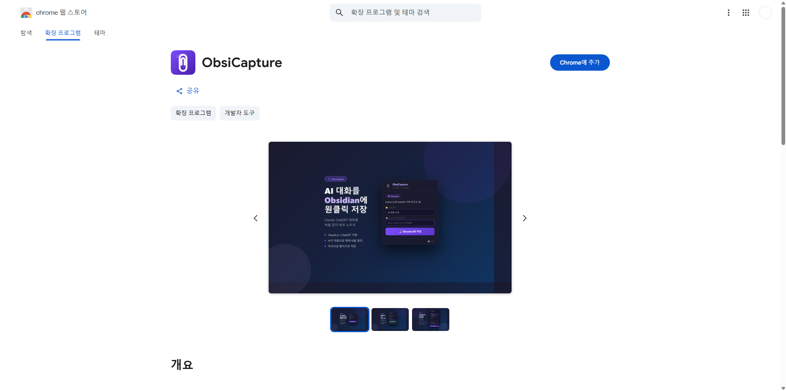
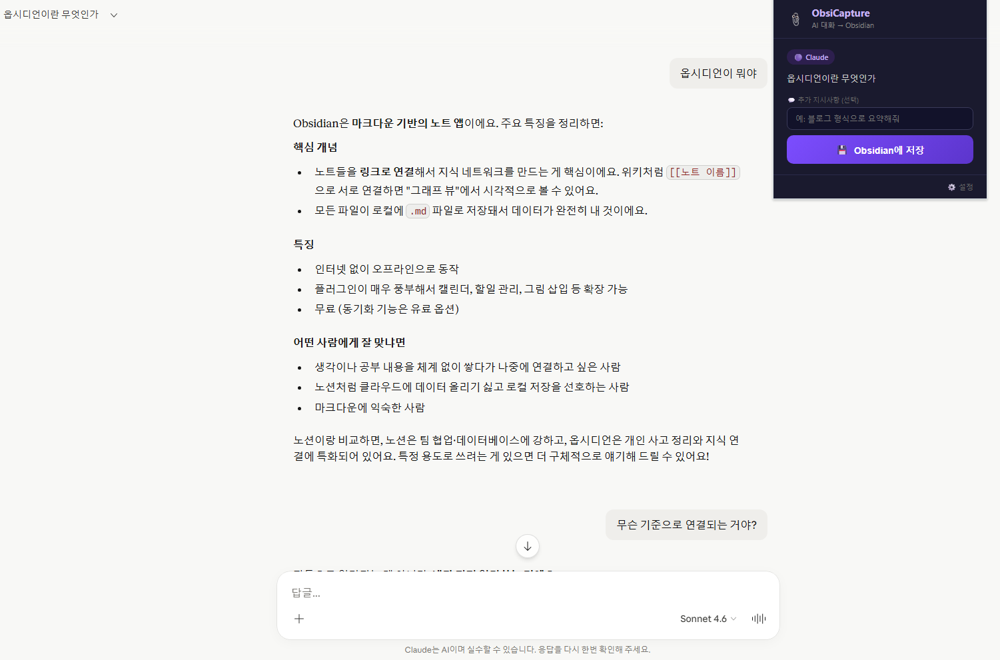
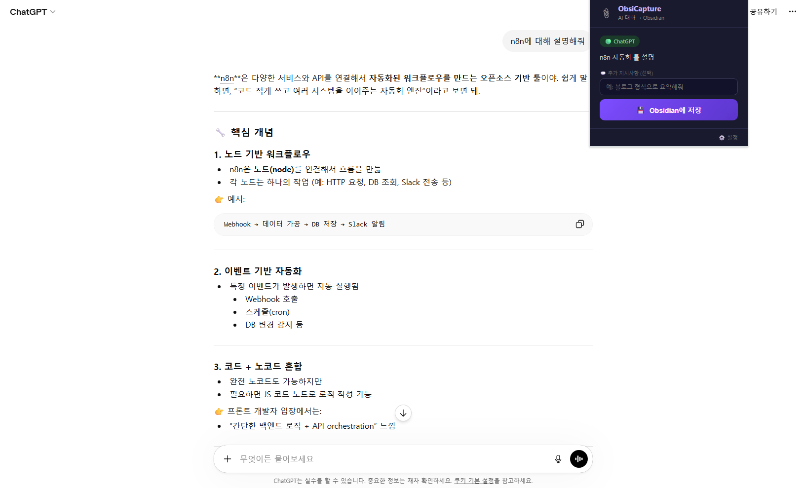
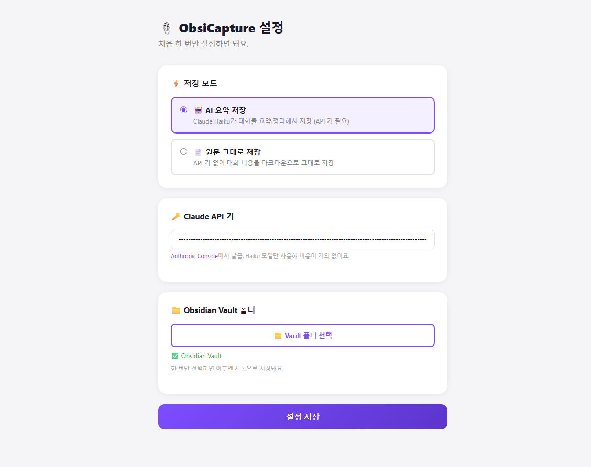
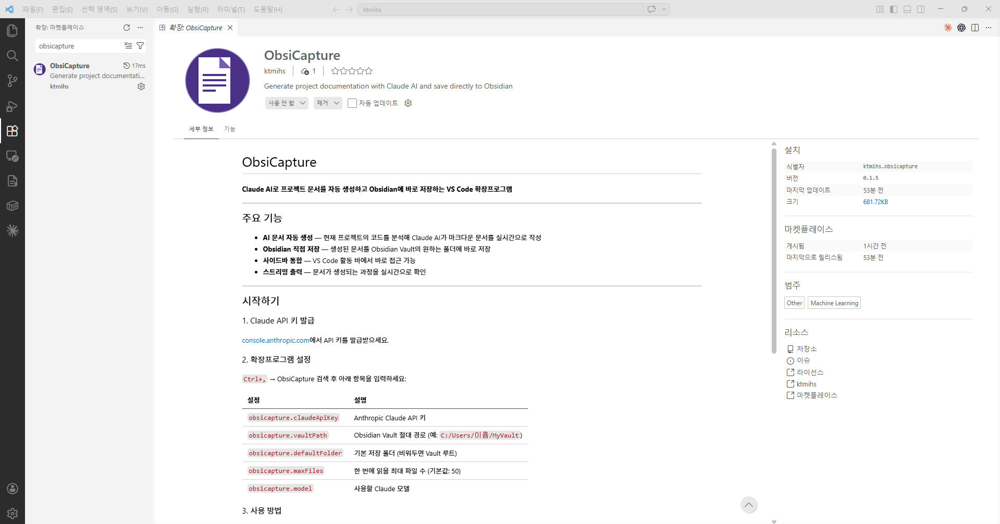
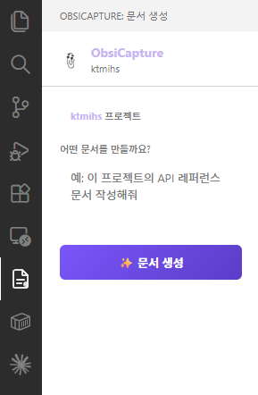

# 📎 ObsiCapture

> AI 대화와 프로젝트 코드를 원클릭으로 Obsidian에 저장

---

ObsiCapture는 두 가지 형태로 제공됩니다:

| | Chrome 확장프로그램 | VS Code 확장프로그램 |
|---|---|---|
| **용도** | Claude.ai / ChatGPT 대화 저장 | 프로젝트 코드 → 문서 자동 생성 |
| **AI** | Claude Haiku (대화 요약) | Claude (코드 분석 및 문서화) |
| **저장** | Obsidian Vault | Obsidian Vault |

---

## 🌐 Chrome 확장프로그램

Claude나 ChatGPT에서 나눈 대화를 복사·붙여넣기 없이, 단 한 번의 클릭으로 Obsidian Vault에 마크다운 파일로 저장합니다.

<!-- 📸 캡쳐: Chrome 웹스토어 상세 페이지 전체 (헤더~스크린샷 영역) -->

### 주요 기능

- **Claude.ai / ChatGPT 지원** — 두 플랫폼 모두 자동 감지
- **AI 자동 정리** — 제목·내용을 Claude Haiku가 자동으로 요약 및 구조화
- **폴더 지정** — 저장할 Vault 폴더를 직접 선택
- **커스텀 지시사항** — "블로그 형식으로", "핵심만 bullet로" 등 원하는 방식으로 정리
- **마크다운 출력** — Obsidian에 최적화된 깔끔한 마크다운 형식

### 사용법

**1단계 — 설정 (최초 1회)**

1. 확장 프로그램 설치 후 아이콘 우클릭 → **옵션** 클릭
2. [Anthropic Console](https://console.anthropic.com/keys)에서 API 키 발급 후 입력
3. Obsidian Vault 폴더 선택
4. **설정 저장** 클릭

> Haiku 모델만 사용하므로 비용이 거의 발생하지 않습니다.

**2단계 — 저장**

1. Claude.ai 또는 ChatGPT 대화 페이지 접속
2. 툴바의 📎 ObsiCapture 아이콘 클릭
3. 저장 폴더 및 파일명 확인 (필요 시 수정)
4. **Obsidian에 저장** 클릭 — 끝!

<!-- 📸 캡쳐 ①: Claude.ai 페이지에서 ObsiCapture 팝업이 열린 상태 (팝업 + 뒤 대화 포함) -->

<!-- 📸 캡쳐 ②: ChatGPT 페이지에서 ObsiCapture 팝업이 열린 상태 (팝업 + 뒤 대화 포함) -->

<!-- 📸 캡쳐 ③: 옵션(설정) 페이지 전체 (API 키 입력란 + Vault 폴더 선택 영역 포함) -->

---

## 🖥️ VS Code 확장프로그램

현재 프로젝트의 코드를 Claude AI가 분석해 마크다운 문서를 자동으로 작성하고, Obsidian Vault에 바로 저장합니다.

<!-- 📸 캡쳐: VS Code 마켓플레이스 상세 페이지 전체 (헤더~스크린샷 영역) -->

### 주요 기능

- **AI 문서 자동 생성** — 코드를 분석해 Claude AI가 마크다운 문서를 실시간으로 작성
- **Obsidian 직접 저장** — 생성된 문서를 Obsidian Vault의 원하는 폴더에 바로 저장
- **사이드바 통합** — VS Code 활동 바에서 바로 접근 가능
- **스트리밍 출력** — 문서가 생성되는 과정을 실시간으로 확인

### 사용법

1. 왼쪽 활동 바의 **ObsiCapture 아이콘** 클릭
2. 원하는 문서 유형 입력 (예: "API 명세서", "README", "아키텍처 문서")
3. **생성** 버튼 클릭 → Claude AI가 프로젝트 코드를 분석해 문서 작성
4. 파일명과 저장 폴더 확인 후 **Obsidian에 저장** 클릭

<!-- 📸 캡쳐: VS Code 사이드바에 ObsiCapture 패널이 열린 상태 (입력창 + 생성 버튼 포함) -->

### 지원 모델

| 모델 | 특징 |
|------|------|
| `claude-sonnet-4-6` | 기본값. 속도와 품질의 균형 |
| `claude-opus-4-7` | 최고 품질, 복잡한 문서에 적합 |
| `claude-haiku-4-5` | 빠른 속도, 간단한 문서에 적합 |

### 요구 사항

- VS Code 1.85.0 이상
- Anthropic Claude API 키
- Obsidian (문서 저장 시 필요)

---

## 개인정보처리방침

[개인정보처리방침 보기](./privacy-policy.html)

---

## 라이선스

MIT License
